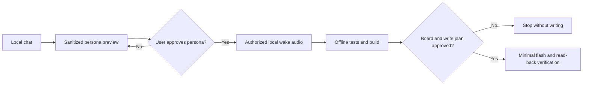

# Client Doll Personalize & Flash

[中文说明](README.zh-CN.md) · [Skill instructions](SKILL.md) · [Project adaptation](references/project-adaptation.md)

[](https://github.com/yun465/client-doll-personalize-flash/releases)
[](https://github.com/yun465/client-doll-personalize-flash/actions/workflows/validate.yml)
[](LICENSE)


A privacy-first Codex skill for turning an approved chat style and an authorized local wake acknowledgement into a controlled ESP32-S3 doll build and flash workflow.

> **Workflow template, not standalone firmware.** This repository contains the skill, safety gates, and a tested reference profile. It does not contain the companion firmware source or customer data.

## Why this exists

Personalizing a connected doll crosses several sensitive boundaries: private chat, a person's voice, device credentials, cloud calls, and destructive flash operations. This skill keeps those boundaries explicit:

1. Analyze the selected speaker locally and show a sanitized persona preview.
2. Wait for explicit persona approval.
3. Import a separately authorized local wake acknowledgement.
4. Build with the target project's locked toolchain.
5. Identify the physical board, show the write plan, and flash only the approved partitions.
6. Verify locally; do not start paid cloud tests without separate approval.

## Quick start

### Windows PowerShell

```powershell
git clone https://github.com/yun465/client-doll-personalize-flash.git "$env:USERPROFILE\.codex\skills\client-doll-personalize-flash"
```

### macOS or Linux

```bash
git clone https://github.com/yun465/client-doll-personalize-flash.git "${CODEX_HOME:-$HOME/.codex}/skills/client-doll-personalize-flash"
```

Restart Codex if the skill is not discovered immediately, then invoke it with a concrete scope:

```text
$client-doll-personalize-flash Analyze this local chat export only. I am speaker "A". Create a sanitized persona preview and do not process audio, build, connect to a board, or call cloud services.
```

## Prerequisites

For persona analysis only:

- Codex or another Agent Skills-compatible runtime.
- A local chat export with distinguishable speaker labels.
- The exact speaker whose style may be analyzed.

For integration, build, or flashing, the target project must also provide:

- An ESP32-S3 firmware project and its locked build environment.
- A local chat analyzer and persona-package compiler, or equivalent adapters.
- A public persona configuration writer separate from secret storage.
- Board discovery, generated flash arguments, and read-back verification tooling.

See [Project adaptation](references/project-adaptation.md) before using the skill with a project other than the included reference profile.

## What is included

| Included | Deliberately excluded |
|---|---|
| Two-stage approval workflow | Customer chat exports and recordings |
| Persona, audio, build, flash, and verification guidance | Wi-Fi credentials, API keys, and voice URIs |
| ESP32-S3 N16R8 reference profile | Companion firmware source and build caches |
| Sanitized demo persona | Firmware images, NVS images, and device backups |
| Validation workflow and contribution templates | Any authorization to upload audio or call paid APIs |

## Workflow



## Try the demo

Read the [sanitized persona preview](examples/demo-persona/persona-preview.md) to see the expected approval artifact. It contains no real chat text, personal names, credentials, or audio.

## Project integration

The bundled [current project baseline](references/current-project-baseline.md) is one validated hardware and firmware profile, not a universal default. A different project should map its own:

- private workspace layout;
- analyzer and persona compiler;
- public configuration schema and writer;
- build command and generated artifacts;
- board identification and flash verification commands;
- hardware, partition, wake-model, and audio parameters.

Do not copy partition offsets or hardware constants from the reference profile into a different firmware project.

## Limitations

- The repository cannot build or flash a device by itself because it intentionally excludes the companion firmware and customer-private assets.
- The included firmware and audio parameters apply only to the documented ESP32-S3 N16R8 reference profile.
- Persona quality depends on clean speaker labels and explicit human review.
- The reference device profile does not enable Flash Encryption, NVS Encryption, or Secure Boot; physical access may expose firmware and configuration.
- Real ASR, LLM, TTS, voice cloning, credential writes, erase, and flash operations remain separate authorization gates.

## Privacy and safety

Keep every customer's chat, recording, credentials, firmware output, and device backup in a private ignored workspace. Do not paste secrets into issues or pull requests. The included [.gitignore](.gitignore) blocks common private artifact types, but it is not a substitute for reviewing staged files before every commit.

The doll must identify itself as an AI character based on an approved communication style. It must not claim that a real person is replying live.

## Contributing and support

- Use [Issues](https://github.com/yun465/client-doll-personalize-flash/issues) for reproducible bugs and adaptation requests.
- Read [CONTRIBUTING.md](CONTRIBUTING.md) before submitting a pull request.
- Report sensitive vulnerabilities according to [SECURITY.md](SECURITY.md).
- Run `python scripts/validate_skill.py` before proposing changes.

## License

MIT. See [LICENSE](LICENSE).
