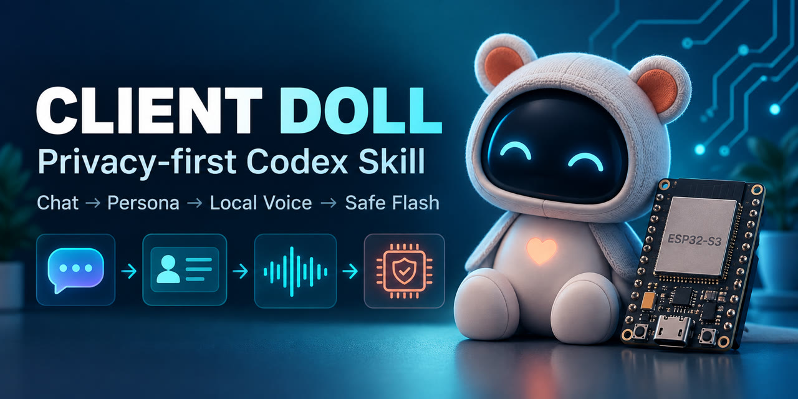
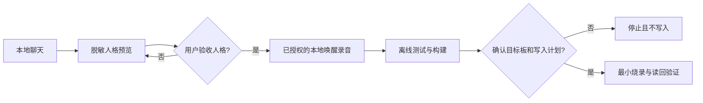

# 客户玩偶个性化与安全烧录

[English](README.md) · [Skill 指令](SKILL.md) · [项目适配指南](references/project-adaptation.md)

[](https://github.com/yun465/client-doll-personalize-flash/releases)
[](https://github.com/yun465/client-doll-personalize-flash/actions/workflows/validate.yml)
[](LICENSE)



这是一个隐私优先的 Codex Skill：先从用户授权的本地聊天中生成脱敏人格预览，经过人工确认后，再导入单独授权的本地唤醒回应，最终以明确门禁完成 ESP32-S3 玩偶的构建、烧录和验证。

> **这是工作流模板，不是独立固件。** 仓库包含 Skill、安全门禁和一个已验证的参考配置，不包含配套固件源码或任何客户数据。

## 为什么需要它

个性化联网玩偶会同时接触聊天隐私、真人声音、设备凭据、云端调用和有破坏性的 Flash 写入。本 Skill 把它们拆成独立阶段：

1. 只在本地分析用户指定的说话人，展示脱敏人格预览。
2. 等待用户明确验收人格。
3. 另行导入已授权的本地唤醒回应录音。
4. 使用目标项目锁定的工具链构建。
5. 重新识别实物板，展示拟写分区，只烧录用户批准的范围。
6. 完成本地验证；未经另行批准，不进行真实或可能付费的云端测试。

## 快速安装

### Windows PowerShell

```powershell
git clone https://github.com/yun465/client-doll-personalize-flash.git "$env:USERPROFILE\.codex\skills\client-doll-personalize-flash"
```

### macOS 或 Linux

```bash
git clone https://github.com/yun465/client-doll-personalize-flash.git "${CODEX_HOME:-$HOME/.codex}/skills/client-doll-personalize-flash"
```

如果 Codex 没有立即发现 Skill，请重启 Codex。调用时应明确本轮范围，例如：

```text
$client-doll-personalize-flash 只分析这份本地聊天。我是说话人“A”。生成脱敏人格预览，不处理录音、不构建、不连接设备，也不调用云服务。
```

## 使用条件

只进行人格分析时需要：

- Codex 或兼容 Agent Skills 的运行环境。
- 能区分说话人标签的本地聊天导出文件。
- 用户明确指出允许分析哪一位说话人的表达风格。

如果要集成、构建或烧录，目标项目还必须提供：

- ESP32-S3 固件工程及其锁定的构建环境。
- 本地聊天分析器和人格包编译器，或等价适配器。
- 与秘密配置分离的公共人格配置写入通道。
- 板卡识别、构建生成的烧录参数和读回验证工具。

不是使用仓库内参考配置时，请先阅读[项目适配指南](references/project-adaptation.md)。

## 仓库包含什么

| 已包含 | 刻意不包含 |
|---|---|
| 两阶段人工确认流程 | 客户聊天和录音 |
| 人格、音频、构建、烧录与验证指南 | Wi-Fi、API Key 和音色 URI |
| ESP32-S3 N16R8 参考配置 | 配套固件源码和构建缓存 |
| 脱敏人格示例 | 固件镜像、NVS 镜像和设备备份 |
| 自动验证与贡献模板 | 上传录音或调用付费 API 的任何授权 |

## 工作流



## 查看示例

[脱敏人格预览示例](examples/demo-persona/persona-preview.md)展示了第一阶段应交付给用户确认的内容，其中没有真实聊天、姓名、凭据或录音。

## 项目适配

仓库内的[当前项目基线](references/current-project-baseline.md)只是一个已验证的硬件和固件配置，不是通用默认值。其他项目需要映射自己的：

- 私有客户工作区；
- 聊天分析器和人格编译器；
- 公共配置结构与写入通道；
- 构建命令和生成物；
- 板卡识别和 Flash 验证命令；
- 硬件、分区、唤醒模型及音频参数。

不得把参考配置中的分区偏移或硬件常量直接套到其他固件工程。

## 已知限制

- 本仓库不含配套固件和客户私有材料，因此不能单独完成构建或烧录。
- 固件和音频参数只适用于文档中的 ESP32-S3 N16R8 参考配置。
- 人格效果依赖清晰的说话人标签和人工验收。
- 参考设备配置未启用 Flash Encryption、NVS Encryption 或 Secure Boot；实物被接触后可能被提取固件和配置。
- ASR、LLM、TTS、声音克隆、秘密写入、擦除和烧录始终是独立授权门禁。

## 隐私与安全

每位客户的聊天、录音、凭据、固件产物和设备备份都必须放在私有且被 Git 忽略的工作区。不要把秘密粘贴到 Issue 或 Pull Request。仓库的 [.gitignore](.gitignore)会阻止常见私有产物，但每次提交前仍需人工检查暂存文件。

玩偶必须明确说明自己是根据已批准表达风格设计的 AI 角色，不能声称现实中的本人正在实时回复。

## 贡献和求助

- 可通过 [Issues](https://github.com/yun465/client-doll-personalize-flash/issues)提交可复现问题或项目适配需求。
- 提交 Pull Request 前阅读 [CONTRIBUTING.md](CONTRIBUTING.md)。
- 敏感漏洞按 [SECURITY.md](SECURITY.md)私下报告。
- 修改后运行 `python scripts/validate_skill.py`。

## 许可证

MIT，详见 [LICENSE](LICENSE)。
